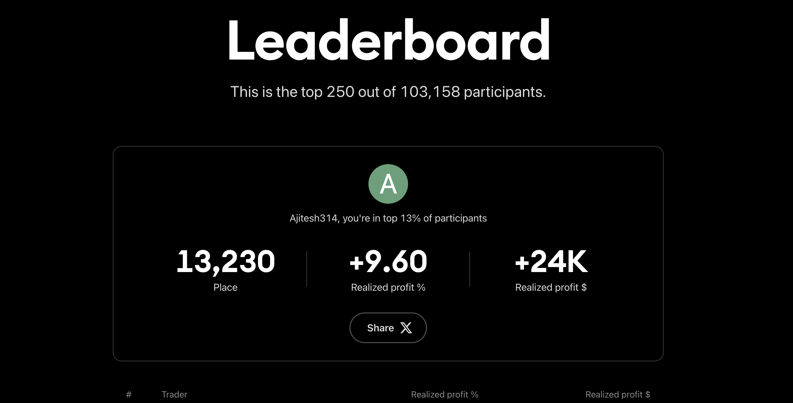
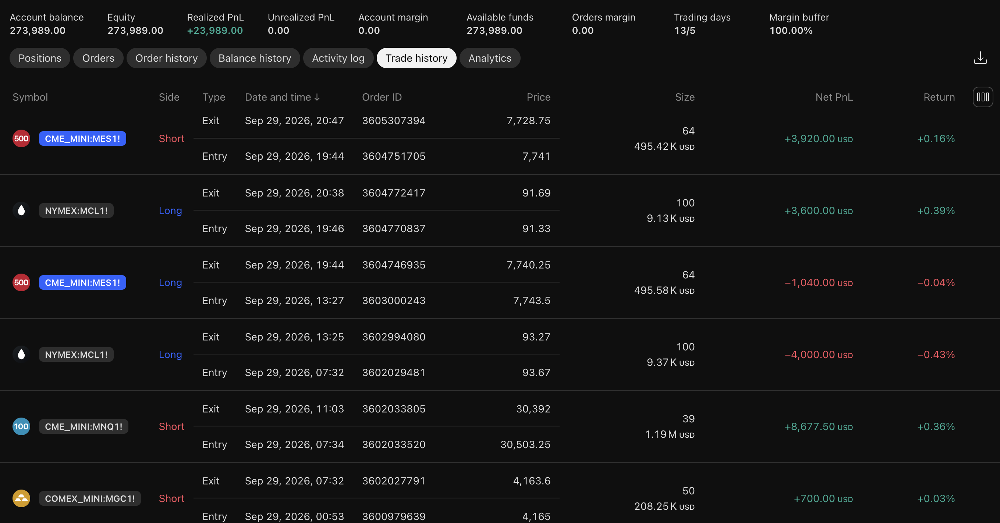
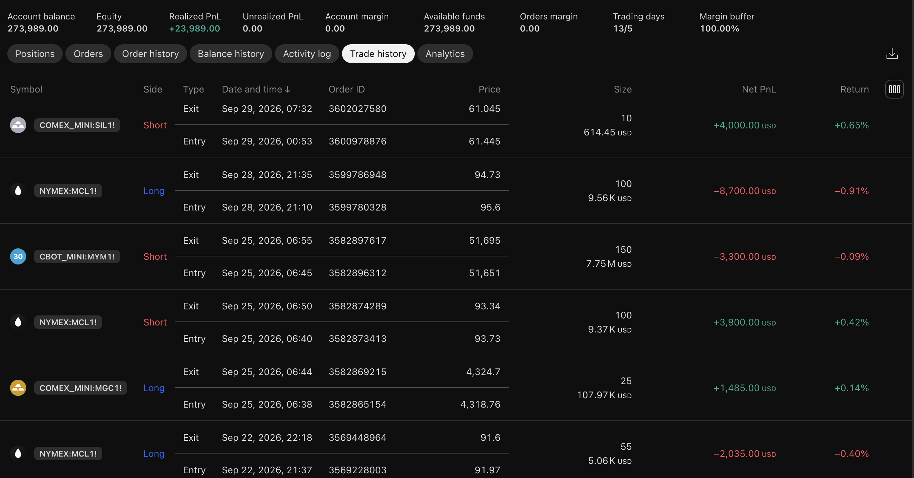
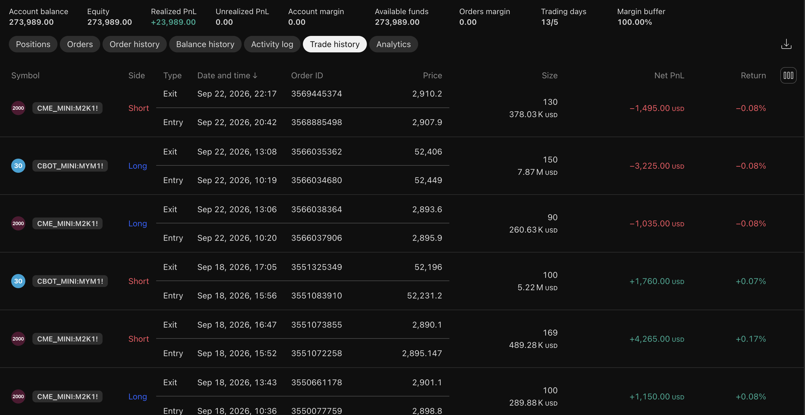
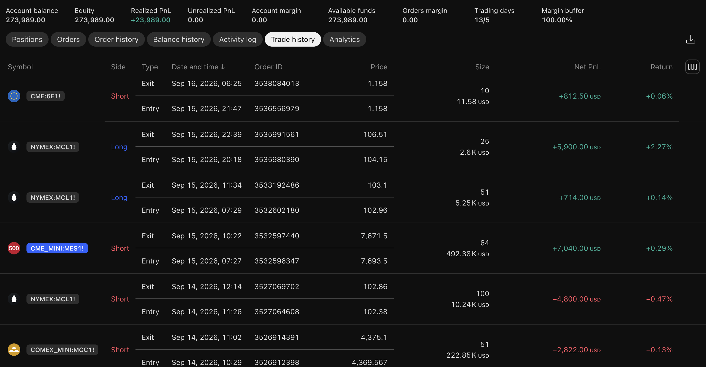
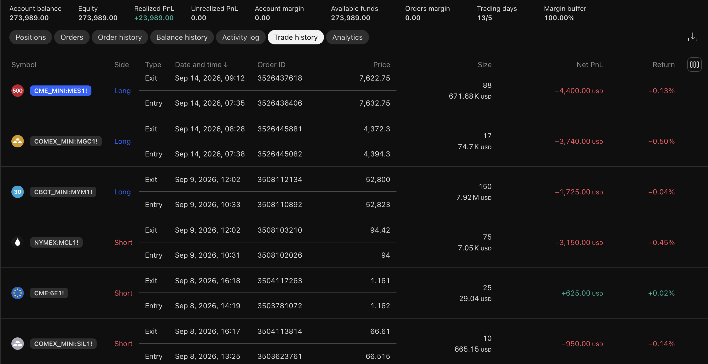
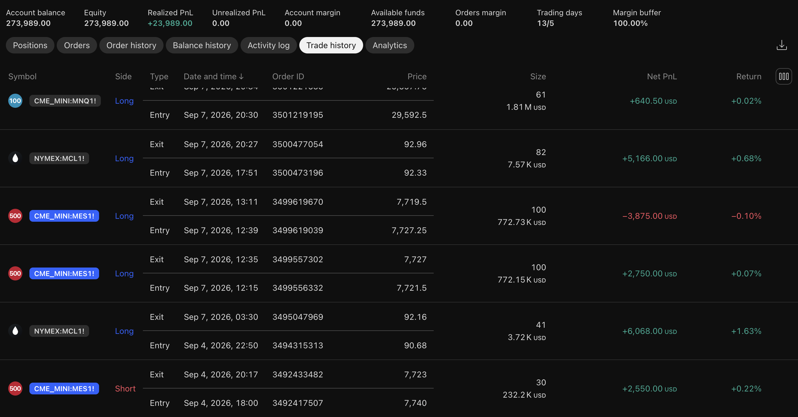

# TradingView The Leap — Futures Trading Journal

### September 2026 | TradingView The Leap Futures Competition

This repository documents my participation in **TradingView The Leap**, a global futures trading competition conducted in a simulated trading environment.

It contains the TradingView trade-history export, competition leaderboard result, and screenshots of executed trades for verification.

---

## Competition Result

| Metric | Result |
|---|---:|
| **Participants** | 103,158 |
| **Final Rank** | **13,230** |
| **Leaderboard Position** | **Top 13%** |
| **Starting Capital** | $250,000 |
| **Final Equity** | **$273,989** |
| **Net Realized P&L** | **+$23,989** |
| **Realized Return** | **+9.60%** |
| **Trading Days** | 13 |

### Final Leaderboard

<p align="center">
  
</p>

---

## Trading Approach

The competition was approached using a discretionary intraday futures framework based on multiple technical and risk-management factors.

### Core Components

- **Market Structure** — Support, resistance and price-action levels
- **EMA Regime Filter** — 20/50 EMA relationship to identify directional conditions
- **Session VWAP** — Used as an intraday value/reference level
- **Volume Confirmation** — Used to assess participation around important price levels
- **Volatility Assessment** — ATR and recent price movement used when determining stop placement
- **Risk/Reward Management** — Trades were structured around predefined invalidation levels and favorable risk/reward setups

The framework was applied across multiple futures markets rather than being restricted to a single instrument.

---

## Instruments Traded

The trade history includes futures across several asset classes, including:

- **MNQ** — Micro E-mini Nasdaq-100
- **MES** — Micro E-mini S&P 500
- **M2K** — Micro E-mini Russell 2000
- **MYM** — Micro E-mini Dow
- **MCL** — Micro WTI Crude Oil
- **MGC** — Micro Gold
- **SIL** — Micro Silver
- **6E** — Euro FX

---

## Trade Performance

The exported TradingView trade history contains **47 completed trades**.

| Metric | Result |
|---|---:|
| Completed Trades | **47** |
| Winning Trades | **27** |
| Losing Trades | **20** |
| Win Rate | **57.45%** |
| Net P&L | **+$23,989.00** |
| Gross Profit | **+$83,472.00** |
| Gross Loss | **-$59,483.00** |
| Profit Factor | **1.40** |
| Average Winning Trade | **+$3,091.56** |
| Average Losing Trade | **-$2,974.15** |
| Largest Winning Trade | **+$8,677.50** |
| Largest Losing Trade | **-$8,700.00** |

All trade-level statistics above are calculated from the TradingView trade-history export included in this repository.

---

## Trade History

The complete TradingView trade-history export is available here:

**[`trade_history.csv`](data/trade_history.csv)**

The screenshots below provide visual documentation of the corresponding TradingView trade history.

### September 29

<p align="center">
  
</p>

### September 25–28

<p align="center">
  
</p>

### September 18–22

<p align="center">
  
</p>

### September 15–16

<p align="center">
  
</p>

### September 7–14

<p align="center">
  
</p>

### September 4–7

<p align="center">
  
</p>

---

## Risk Management

Risk management was an important component of the execution process.

The trading framework incorporated:

- Predefined trade invalidation levels
- Stop-loss based risk management
- Risk/reward considerations before entry
- Position sizing based on contract characteristics and stop distance
- Monitoring of account margin throughout the competition

At the end of the competition, the TradingView account showed:

- **Account Balance:** $273,989
- **Equity:** $273,989
- **Unrealized P&L:** $0
- **Account Margin:** $0
- **Available Funds:** $273,989
- **Margin Buffer:** 100%

---

## Repository Structure

```text
futures-leap-trade-journal/
│
├── README.md
│
├── data/
│   └── trade_history.csv
│
└── assets/
    ├── leaderboard_final.png
    ├── trade_log_p1.png
    ├── trade_log_p2.png
    ├── trade_log_p3.png
    ├── trade_log_p4.png
    ├── trade_log_p5.png
    └── trade_log_p6.png
